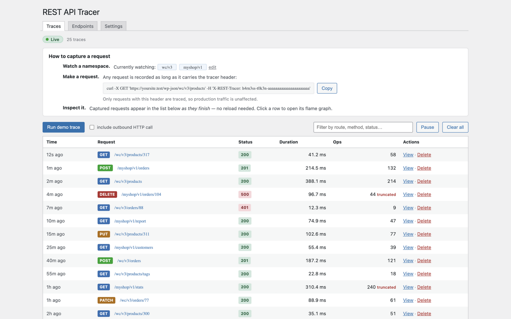
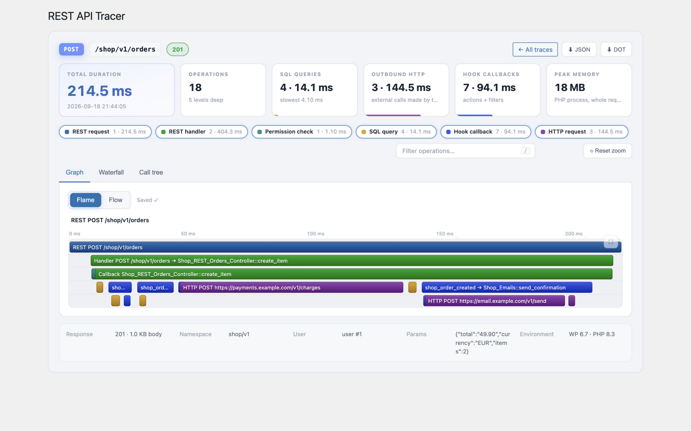
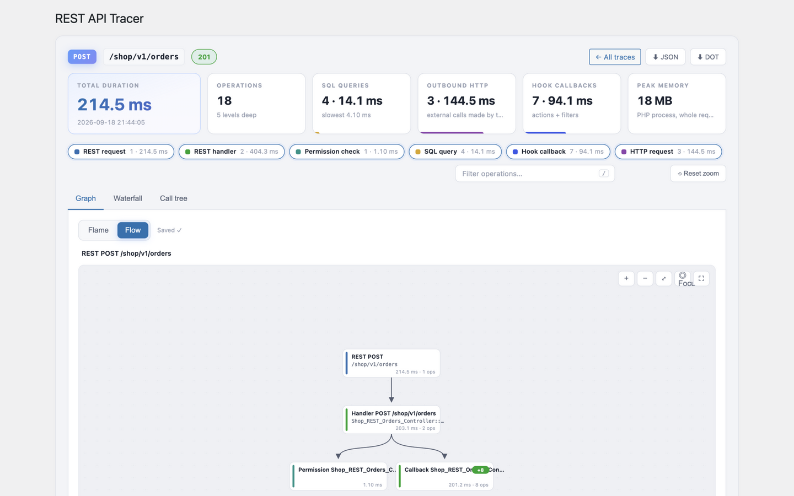
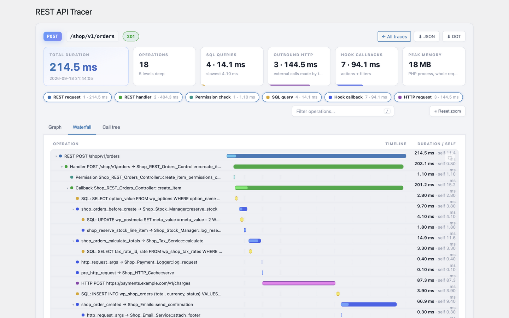

# REST API Tracer

**REST API Tracer answers "what exactly happens inside this endpoint, and where does the time go?"**

Pick the REST namespaces you care about — `wc/v3`, your plugin's routes, anything — and every matching request gets recorded end to end:

- every hook and filter callback that runs (via transparent callback wrapping),
- every SQL query, with its caller and per-query wall time,
- every outbound HTTP request (URL, method, status, duration),
- the REST handler bracket and permission check — resolved down to the real controller method, even behind framework-style delegating handlers like `Route::callback → CourseController::index`.

Then explore the trace in wp-admin, your way: an interactive **flame graph**, a **node-map view** of the whole request lifecycle, a **waterfall** timeline, or an **aggregated call tree** for hotspots. New traces stream into the list **live — no page reload**.

Tracing is **off by default**: in header mode nothing is recorded unless a request carries your secret `X-REST-Tracer` token, so it's safe to keep installed on production.






## Requirements

- WordPress 6.0+
- PHP 8.0+

## Installation

1. Download or clone this repository and place the `wp-rest-tracer` folder in `wp-content/plugins/` (or upload the ZIP via **Plugins → Add New → Upload**).
2. Activate **REST API Tracer** in the Plugins screen.
3. Open **Tools → REST Tracer**.

## Quick start

### 1. Tell it what to watch

Go to **Tools → REST Tracer → Settings** and enter one or more REST namespaces, comma-separated — for example `wc/v3, myshop/v1`. Not sure of the exact namespace? Use the **Endpoints** tab: type a namespace and it lists every route under it, exactly as the tracer would match it.

### 2. Capture a request

There are two trigger modes (Settings):

| Mode | What gets traced |
|---|---|
| **Header** *(default, production-safe)* | Only requests carrying `X-REST-Tracer: <your token>` |
| **Always** | Every request to a watched namespace (the plugin's own admin API is never self-traced) |

In Header mode, copy the ready-made `curl` command from the "How to capture a request" card on the Traces tab — it already contains your token:

```bash
curl -X GET 'https://yoursite.test/wp-json/wc/v3/products' \
  -H 'X-REST-Tracer: YOUR_TOKEN'
```

Any client works (Postman, fetch, your app's HTTP calls) — the header is the only requirement. You can also hit **Run demo trace** to capture a sample request without leaving wp-admin.

### 3. Watch it appear — live

Captured requests appear in the Traces table **as they finish** — no reload. The list shows relative times, method, route, status, duration, and operation count, with a text filter, pause/resume for live updates, and delete/clear actions that don't navigate away.

### 4. Open a trace

Click any row to open the viewer.

## The viewer

### Stat strip

Before you touch anything, the strip answers "where did the time go": total duration, operation count and depth, SQL / outbound HTTP / hook totals with each category's share of the request, and peak memory.

### Graph — two styles

Switchable with the **Flame / Flow** control (your choice is remembered per user, stored in the database):

- **Flame** — the classic profiler view: the request at the bottom, frames stacked upward, width proportional to duration. A millisecond ruler sits above the graph. Click any frame to zoom into it; the breadcrumb trail navigates back out. Dense stretches of micro-operations automatically collapse into aggregate frames ("N operations · X ms") that re-split as you zoom.
- **Flow** — the whole request lifecycle as an interactive node map: cards and arrows from the request down through handlers, hooks, queries, and outbound calls. Drag to pan, scroll to zoom, click a node to collapse or expand its branch. It opens focused on the initial request so you can navigate step by step, and the **◎ Focus** button returns there any time.

Every canvas has a **⛶** button that expands just that graph fullscreen.

### Waterfall

Chronological rows with gridlines, colored bars, and self-time rendered inside each bar — the view for "what ran when". Rows collapse with the caret.

### Call tree

All operations aggregated by name, sorted by total time, with share-of-request bars — the fastest way to find hotspots.

### Everywhere

- **Type chips** are a live legend *and* filter (SQL / HTTP / hooks / handlers / permission).
- **Search** (`/` to focus, `Esc` to reset zoom) highlights matches across the current view.
- **Tooltips** show duration, self time, percentage of request/parent, SQL text, URLs, statuses, and callers.
- **Export**: download any trace as JSON or GraphViz `.dot` (render with `dot -Tsvg trace.dot -o trace.svg`).

## Settings reference

| Setting | Meaning |
|---|---|
| Namespaces | Comma-separated REST namespaces to watch |
| Trigger mode | `Header` (token-gated, default) or `Always` |
| Trigger token | The value clients must send as `X-REST-Tracer`; clearing it generates a new one |
| Capture | Toggle hook callbacks, SQL queries, outbound HTTP independently |
| Max operations per trace | Safety cap — traces that hit it are marked *truncated* |
| Keep last N traces | Retention; older traces are pruned automatically |

## FAQ

**Is it safe on production?**
In the default Header mode, nothing is traced (and overhead is near zero) unless a request carries the secret token. Tracing itself adds a small per-hook cost, so avoid long "Always" sessions on busy sites.

**Where are traces stored?**
A custom table (`wp_rest_tracer_traces`), gz-compressed when large, pruned to your retention limit.

**Does it trace the tracer?**
No — the plugin's own admin REST API is only ever traced with an explicit header, even in Always mode.

**What's *not* captured?**
Raw internal PHP calls that never pass through the hook system, WPDB, or the HTTP API (a plain `str_replace()` inside a controller, for instance) appear as part of their parent's self time — that level of detail needs Xdebug/Tideways.

**What happens on uninstall?**
The traces table, settings, and per-user viewer preferences are removed cleanly.

## License

MIT — free to use, modify, and distribute. See [LICENSE](LICENSE).

Built by [rafiahmedd](https://github.com/rafiahmedd).
